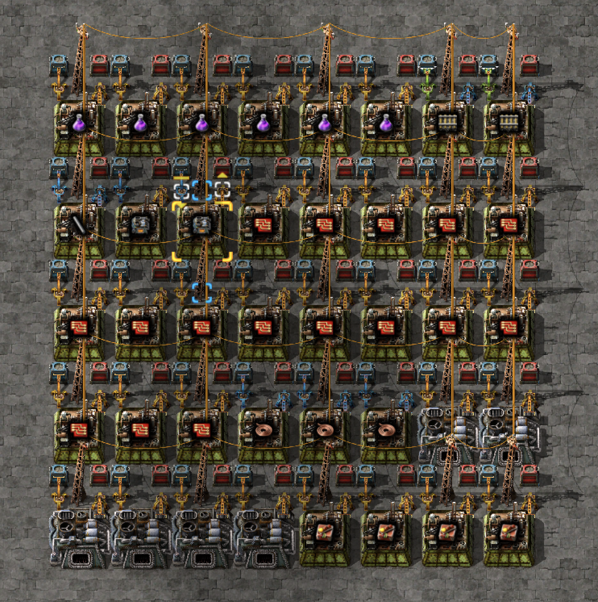
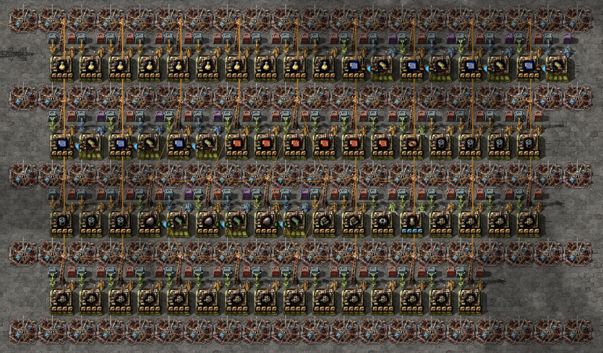

# Pytorio

Generate blueprints for your factories with a single command.


## Run

```bash
# python src/main.py <rate_per_second> <item>
python src/main.py 1 production-science-pack
```

<details>
    <summary>Blueprint String</summary>

    0eNrd3d1u2koUhuF78XEczZofzzi3slVVhDittcGwDUStqtz7NuTPTYbxN2uRgzgHbULBBvNk5Ky80D/F7erQbPu22xc3f4qm27f7ttkVN/88f/H7e3dY3zZ9cUNXRbdYN8VNsdjtmvXtqu1+lOvF8mfbNaUprortZjfceNMdN/SruFFXxe/hz8er4q7tm+XTvwwXDp+32+Nmtv3m7nC6vNwt26ZbNuV2sfy3eLz6sG/9uu+22zX9frjsw/5KOu2w1O/2GNmced3cavOj3e3bZbn82ez2Zd/8dxj+Tm3ePB4fwulq3+/b1XDdp6P1vMF+0a6GG7fdXfPrdMyWm8Px2AZzbcYf9ni3nm/TrIY72w934v7Qd4tl83Z7/Xp7fe29G93m5eA9DI+rXA+fr0Y3M+9u9i1yDCxwSONH1Ea25s4d0e2ApX0Yntl+89DeJXZyPK63i6OzyOar182vm7v2sC5fD9l2c3rgUXvDHY9sy2c6Nhd0HICDrmHGNYOxnpdiUsARtTBjIr5jCzgmnYmvuiA+MsCxcrA+sgx+bmb8HHBIPc6v4vPzCD+fuY5WiXWUQqbl+pKWa+DAB9iyVgzLYV6WNSFnBArGrLXgnEABmrXJBEj6kqek0AkUfk6qHYMgzeykVFfIQTW4QS8waBCDIXNFJZ1YUnWdK9pdULRBzqXI4j9lEUe0nZdog/zoShUs2hiB6AoQbWyuwTBl8PRkxXb1tuTt9gPKMnGEPM6u4rDzELvdftM1MXek3bUauRn20qzK7WqxjzJ7f/W2P35/Dvf035iup2tHdb2tb/eL4REmDmCNEwsCYjVCrM5dNENi0bQqE6wmLlhLMFitYLBWc36OV18SrDUoWK1hsNbywWoNgLUuE6ymFNiKNUl1572Ono3Y/uBF4nnGaQCzgT9C1WmypwfzDiIhtGp4LYw9yuhUU0nHmjrFyhFrrGliqJxmjTUTqD6cLsX2in87o7KcZU819dRaGFni/j511ONzv8Xdw2I4X74rl22/PLT72Lpo6bryTr192L/W1GHxLW/7M6vk8w5jlp2Dx5oI40o61Uwz9qyhppReQOk5mF7NnmjOh16l4JEmQK8i6UQzSa/SrIFmdAWtDGuemWD84VmM7dXCg0xAcOXYc8wJwYPd09aOT0VEsFbXwdBfhpeb7bbpy+XidtWc81sFb+uXj+rDz+qb7nj/338LmI97jUKu8HkmItmLx5lpyoE3zZT6q/ExJgDQK/4Uc3YCPeHTTECg1+JhZlKgN7xZZnQ19ZY3yhRy9g6fYSKcK/4Ic36cPT7KRDgH8SQzzbnmDTKFAgM0RfeowED8aebsBAZomF6jAoMRDzqTAoPlzTmjC2pwvDGnlDNyFqUVzNnzZ53z4wzlYBrmXIvHoEnOteJNQaOca15OSkrGuc4oSQNQ4AlKUj83zjWelIZpzbU4KfVJzLykNEQt85JSsWW8JkUo82vS2UkmhWelAGVS4qw0aZkULyuVAiSFF6WAQFL8onSGBPG0FCIoTksnCPLS0uh6SoqXlso941Up4pn4Ven8PFNGXoqAJnlemhZNzLxUrJAyylKIoaAsnaHDjMQUcihPTCccMhPT+NJKzMRUrFpn1KWIai2oS+enWmdkpohqLc9M06o1MzOVO3T4fBZyKMhNZ+jQ4xNayKG8RZ1wyGxR46urYbaoYtWG8DEtotoImtT5qTYGH9Qiqo08WE2rNsxg9YxqXrBKTora48NaMohqQbVKen6sa3hgS8DvH8iKc1lK/gKCLC+YpehvIMjyklkxa2vguS2k2vKL2Rmitng6i6EWx7NTqHn5rJxhgIe3GEN+PTtDhg7PaCGGThzSTjB0vJT2zNrqeDFtCvVfT2l0nxYtwgOu2vGL2inVzw/o/EtdiK7pjK4Kfq2LyjAmT1ynkDEjV5kL/IVBGeeSlaB0/UQZo+B+6sEaXEYlT08nZFTM+PTM+lMx81MRtFF9P3XsbQY0QYP6mdDwlx5XGdDkUegUtLfVIPKGAGeGjgkV41faRN9yJ6MHhTx4QRFKmvlyYeeunQujN1aIo/AZgSbkwcsTzQkPnhlpnll4RgH6NK+X6Z+EV0afifESFJqfzisjmMR4yZPJCV6BGU2e4TXKwad5PWeziq8rZOSShMyVgyCYJP+5ugLeLxIy5Q3igpHSU97AaxgpPuUdpdnTtIycFl4vYrL4/eJnw6rxmhCCVYtzwglYo0p6mkIlplDjGSFEoeZ3hJ9OAa/6MArirG+KAq/rO7PGjJLlaVi1HBbe8yGwtOIHfZ8MS6uMvA6RpZW8r0vT0ooZ2Gng7e7G79cW3XdGY4fREER2UzZS8+h3U/DxG0LozDeUiGwgTi2joMOoyRO6KWrMhi6+jGnFjOguIZcyOjpILglCui8mlzIqOUguyTO5CbnE7OQuQi0jlcOoCVq5r0YtI4TDqMlLuClqzBTuzCKpmS3cJeTqjBwOkqsFPdwXk6szYjdIrpbXbhNyNTN3O8r9dlXs29Xpv7wZPm2Xm+7pyXl7Anbtj26xOt7y5Vz9dEHZdvebYdP73yeaD22/PwxXO22x3Tfr4bK3/1vnqlgtbpvV8Q4u2m748mFAcLo/3ijyNXlr7ePj/4v4CK8=
</details>



---

```bash
# -b Generate blueprint with beacons
python src/main.py -b 10 production_science_pack
```

<details>
    <summary>Blueprint String</summary>

    0eNrlndtu28gSRf9FzxbAvnfnVw4GA1mmE+LIko4ungkG+fdD+jJmEpK9a7dNWPZTMh5pS6JWV9Gs1cw/i+vNud4fmu1p8eWfRb09NaemPi6+/OfpP77/uT3fXdeHxRd1tdiu7urFl8V1vVrvtourxX53bB/e/rV96t+LL0t7tfje/uF+XC2aU3137H5+3Nf1zfJud3Pe1Euz+KJ//Lj6LVvnsxWbbbLZmo222WjHRrtsdGSjfTZa0Qc75LNpSGI+O7DZKQ9JxWarKh9u6PD8stSeDs+vS53o8PzCNPTKVPmlaei1qfKL09CrU+WXp6WXp8qvT0uvT5VfoJZeoCq/Qh29QnV+hTp6hWq4cRp5Ntw4iWy0cRLRaOMkotHGSUTDjZPIhhsnkQ03TiIbbpzybAP3TSIbbptENtw1iWy4aRLZcM8ksuGWSWTDHZPIhhsmkQ33SyIbbpfybAt3SyIbbpZKycPhbsmEo+2SyUb7JZONNkwmG+6YTDjcMplwuGcy4XDTJMId3DWZcLhtMuFw32TC4cbJhMOdkwmHWycTDvdOJhxunkw43D2ZcLh9EuEe7p9MON5Akzwcb6BEONxAiWy4gRLZcAMlsvEGSoTjDZQIxxsoEY43UHl4wBsoEY43UCIcb6BEON5AiXC8gRLheAMlwvEGSoTjDZQIxxsoEY43UHl4xBsoEQ43UB3k4XADZcLRBspkow2UyUYbKJMNN1AmHG6gTDjcQJlwuIES4QluoEw43ECZcLiBMuFwA2XC4QbKhMMNlAmHGygTDjdQJhxuoEw43ECJcFXBHZRKf1mjq+OxvrveNNuvy7vV+luz7Z7222s9fpCqfaWb5lCvH/9P+8P2782+izmfmk37Esvjuqm363q5X63/u+i9r/2hfUvt8+67B728PTv89l5WebM91odT+9NR30j/8qYGA19W9mb3tTmemvVy/a0+npaH+n/n9s+pF+iukT897M/bZtM+9tG+egpsP9m6Ph67A3jeNqfuQ29v6r8fdKz17txpW0p3b+rp8beb791jD7vr3Wl5e+h++O9T9PBTNru/ljf19vhwgE+H9jieD71nmf6z/hj8/BY4oMPH0w7mubHjuW95au7b7/+wu29uJl6mO6rXqy5s8AVeas5dfdOc75b1pn1Hh/Z19rtNPQbocgT3IMTdzIt7BL4dLaA9EbTrDwN7z+YaP5wWh70ncIlhtwjsPYkLw9PPimdPAxs/ng7Hs2d+4Xi6j4OnAw5nEODpeTwDhGcQ1mI/VYt7DhoGe5oX9gR8OxGHvSeu4bDHDwN7T62bOPGocNp7Pp38zKNCcO9ZdRigSs9KqIbO5QQnx9oRiKqPc3LcswYnDqgRMBoKGDUQo1FYkpWeqsk9RxBE3s2KvEHO6JTFkTeKQd5+GOQN8gu28jjyxhQg7xHke+4jyGicl1HktE4FAaOeYTR8HEYDckCTgNFYwGiCGE3SshynynJP48SQ12pW5C1ycqcrHHmrmQsX1YdB3iK/aWuNI28tj7zWCPI9ORVk1M7LKHJyp42A0cAwaj4Oo9DFSidgNBUw6hBGe8ItVpa1nSrLTjo80WFW5B1ycqc9jrxjpifafxjkHfIbt4448q5gfKIjhLyXTjwGJ3y6x+jAN8Xh+VJAj6eW8+XEMU0CSCMDaYIgfSwXu20X2RzW5zFOqx51q5v7VbuUb35/hs4Dh1yENIJ5na944Aw0sOtZzViNNZMTOy8diRiT47e+23cF4Ly5PXfvarVubpbt5znUm8XgO3gperer9kBNfBGC0ZxnZh8Gm80NfrQBTv0wdD1LOveBBcMzP/pb7KorGJPg/Xu9ZTBYPNP1c1W4nlmdq3BGMDfzzFjXuHdZ4QJyRc8IpmChYEhroDFYz90GK9zkHCxIxwwmvXKF6ynduQUvGHgFZppg4hwVrmeCZz6wFUykQqArnK2mKlyQTkqtnqvC9eTxXIWzgklUZIalVr3LCheRi2NWMFWKBZNPC02Veno6VuHs5FQpSq/YW/fKFS7CpzRWMDyKzIV5a+eocD3fPfeBBcOdGPkK56cqXJTOHW2cq8L1FPlshRMMdRIzeLThXVa4hFxnsoIBTSoYIlpoQNOT8MEKNzmgSdKL3069coVL8CmNE8xhEnON21VzVLie0p/7wII5SUp0hXN6osLpqqJE+/jmBU73tgDkCtyTCO/z5OhK86K9e1flTVcGduZ9HjFd2VJl3k2VNt1T8iXGvB+Gw1PCfHytuqYr+ERG42xGWot3b1nTdM/Xz521wbipij9ne/rIg7GKUtVnqGc9iT5XzxyMjDK0qv7OqpmysHUO4eVKpfPpaqY85ZwPVzMVKOX89aqZgk9aIo5mosXyt61mPeM982FVBfOmFV3Onl5luJ5pzcneMxS0noeeK2gKP0HTlpe931lJ0w73tiHGfLG2PV3UdOCs7eGqpiMnbb9eWdPweYuyMKCm4tXsty1sPWk893E9DJ3RfGHzE4XNGE6XjuOS0tBapSpbT+XOVraAg+N4XzoDzn6zeojrlvYAL9r2Ktp6t9/Xh+V6db0ZVJNs7D14qmSafv4wkB43pCEWQ7EgPV0ATeT86OECaBKnR8+BuMUvH+sKRtwq3o++TMStxo1oBHFrioXoacSt5XzoWaB0OJQGh9LzQvSFQhlwBRqCMhYb0BkoEydAD9ddV3H+8xyIO/yqtvYw4k7zAvRlIu4MrjwjiDtbbDxPI+4cJzzPAqWXGs8QlIEXni8Uyohr0RCUqdiKnobSV5wUPVx3veKc6DkQ9/jVd4NPbLzhbenLRNwjl+kNPgbyBdfpjUUQ95yGPQHlr4ebAzJIHWwIyMgr2Bkgnz51y+WpHiIyjhGDq5gGn++EqlinnuYmKM6mHi6NQXMy9QSFwxvNKBYDcjJl8NFPsLxinbtEeqrrzTiEP+2ru16d2qd/z+6/wyriwFPaJ9Tbr903+PPWQJsdDQRkNGDx8VMoGA3YClkOgXO9ZwIYOfGy+BAqJN7z/hwAxwq3xxGAoyqWx6cBjppzx4freTScOj7PcojISZrFR17R8UL5J1kOyKTD4lO3WDDpsB5ZDpEz22cCGNlfbPHRW6p4q/1zAJwU7sojACddrMpPA5wMZ8oP1/NkKQ1a+VmWQ3L47caVRdaD5y1oZT7HggiwXf3rIR9eELFUr1ZmekEkyq9WdvgfTq4owXqeBWEqBd+QHFkPhtoVoD/RcjDQZgMLLwdTstvAAsvBVI4SwecC2MO3LMcADrQH/lkAjrBfjgGcSgXzDMCqogzzkXou3heRBpfDTzLmyDdCLQjB7oiILwtqe0SElgUqE/cRHiI3qxEbaGeEqnB0S/ZGPL9Ohl3p7og0yW7gHPhJeB9M4s35un1Pq+1pwiI2+OYIpQRoJt5zz7H528caInN4XGMEuyMMjlzJ9gjz/JkHgzUnmc9W2CS7JCyOD7dNwr6z0obtkPACznzxbb4zpU2+R8JN1Tb5Jon4mrVNsEMi4HByWyTCm9c2wQaJhDNXskMiTdU28RaJJ398ttom2CehKwE+jrfI309tgzY/aC3gLBSr4ZnaJt7+oNVUbZPvf7CvWdssfCajDQ4nt8XBvHlt621EyH1ahzM3vh0hW9u0m6pt8m0IIXt95jVKmnX4vakxXjyvZr/mpZmmLXrLr/XqsPzrW91Ha+QSzb47pvg9qA225yAK0IvFRnam3NnEKdlvzaBD3AqdcAad4k3sS2IQurG8wYc2xpliATvDoLOcgT3ScuW7DPJzm4FvjcPaSxVsDO7AO9g5uB8++ijbI460cYLbKwtGJkW7AaCZia84V3qKnuc1PPbvfw+z4pXUjoZY8ZrXo9+GFW+kdjTEirfFenSOFcf50SOFS67ppyx6o/+uBlW+JMK+YETBGfvYjCKn7Id+sx1s5GONeWhzisnDnnDrGcK8ZBeAhSYZQXHe83xcBi291TXEZTC8An1pXAaLy8wYl67YZs5x6TmdeaT8yvV+Nzfm+EmVFcxRONPfXiTmmLMvmLYUSfvQtCVqTlOej8topPfhhriMljeWL45Lh7vHGJe+WD7OcRk4+3ik/Ipt/MdzF21nozxJb8asgft4G8rLf34BdVmUQ4b98LEbhLzEsO8dwXHGxYZ99fzmB9MsJRTPh3gS3HxIQLinzeKLAzzAijAGeCxVhHOAJ0oRng1JW1XCW0YjSNpK0a7whSFpKw1LvwiStjKl0u80kraylPQ7XHOt2IFPcwPuhdYvBnigrd+LAzzibjBGeCp2gzOIq4qzeeejUinpja0hLJXmjd9L41IZ/NbXEJfKFt/7Osel425+PVJ7lefE5BkxD1IzGcM88mbyxWGecH8ZwlxXxf5yBnOtOOF4Pi61lt59G+JSG15KvjQutcVvvI1x6YrvvJ3j0nO33h4pvzpw7vSMmEepPI1hnnh5+tIwNxWuWEOYG1WsWGcwN5pzoufj0hjpTbghLo3lvemL49Lh99/GuPTFN+DOcRm4O3CPlF8TOb17RsyT9EbcEOa24nXvS8PcKlz5hjC3ulj5zmBuDad8z8eltdJ7cWNcOl4BvzguPa6BY1yGYg08x2XkNPCR8ivf2TDztM26SiqDQ5hTOx3MRc7bLLbbAR+42aLdDsjEzTrLCeYzcumk4jnGpefF84vjEpkDG8HUzcVimT3HZeJk9pHyK99HMffgTbK/QjB54/ZXXObozRtcZocwL9mzYaHRm3eczD4jl14qs2NcBl5mvzguIy6zY1ymYpk9w2WoOJm9K79/XC1OzabuvpL2r816t338dl6+h2PzdbvadM98/hIeftCidbtro0/fHzi+bw6nc/uwh8QO3u52dptzvT80224r72Z1XW+6N7hqtu1/3rcUPLyfYCoVkgrtL24/fvwfZDR1Tg==
</details>



--------------

## Features

Generated blueprints:
- Use logistics robots (no belts or trains).
- Fluid transport using barrels.
- Works for recipies that require Assemblers and (Electric) Furnances. Covers most recipies.
  - Other machines (stone furnaces, refinery, etc.) not supported yet.

---

### Setup

```bash
python3 -m venv env
source env/bin/activate
pip install -r requirements.txt
```

### Tests
```bash
    export PYTHONPATH="./src:$PYTHONPATH"
    python3 -m unittest discover -v -s ./test -p *test*.py
```

### Export requirements
```bash
    `pip freeze > requirements.txt`
```

<!--
### Uninstall all but requirements.txt
https://stackoverflow.com/questions/13176968/how-can-i-use-a-pip-requirements-file-to-uninstall-as-well-as-install-packages
-->

---

### Further ideas

- Add compatibility with machines that aren't 3x3 size. Add more machines. Chemical plants, refineries and space age content.
- Optimize placement of machines to minimize logistics robot travel time.


